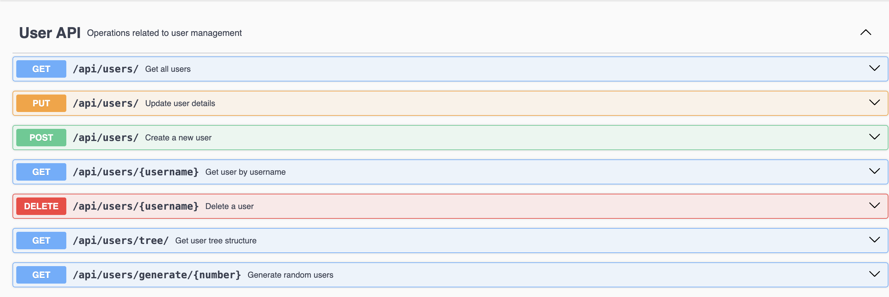

# optimal-api
# Spring Boot User Management API  

This is a **Spring Boot** project following **SOLID principles, CQRS, and best coding practices**.  
It provides **RESTful APIs** for managing users, including:  
✅ Pagination  
✅ Swagger API Documentation  
✅ Error Handling & Logging  
✅ Unit Tests  
✅ Random User Generation  
✅ Hierarchical User Structure  

It uses, H2 database, which is an in-memory database, so no external database setup is required. But it will hold data only till lifecyle of application

---

## 🚀 Getting Started  

### Prerequisites  
- **Java 17+**  
- **Maven**

### Swagger
Swagger URL: http://localhost:8090/swagger-ui/index.html#/


### 🔧 Setup & Run  

1️⃣ **Clone the repository**  
   ```sh
   git clone <your-repo-url>
   cd <your-project-directory>

mvn spring-boot:run 1️


